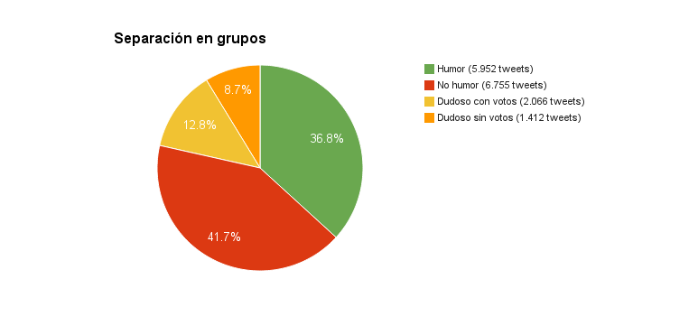

# pgHumor: Humor detection in Spanish tweets

This thesis is about deciding if a tweet written in Spanish is humorous or not, applying Supervised Machine Learning. It was carried out by [Matías Cubero](https://github.com/matu1104) and [Santiago Castro](https://github.com/bryant1410), and supervised by [Guillermo Moncecchi](https://github.com/gmonce) and Diego Garat. For detailed information, see [the final report](InformeV3.4.pdf).

# Abstract

Looking at this tweet:

> — Yesterday, when leaving work I ran over a unicorn.
>
> — No way, you got job?

which is the translated version of this one:

> — Ayer, al salir del trabajo atropellé a un unicornio.
>
> — No jodas, ¿tenés trabajo?

Make us think: what makes it funny? What is Humor? What generates laughter? This project tries to approach this. Theory does exist, however none manages to be completely accurate.

16,488 tweets where fetches from humorous accounts and 22,875 from non-humorous (news, philosophical phrases and interesting facts). A [web app](https://github.com/pln-fing-udelar/pghumor-clasificahumor) and an [Android app](https://github.com/pln-fing-udelar/pghumor-clasificahumor-android) were made so people could give their opinion about which ones are really humorous. 33,531 votes were received from early September to the end of October 2014 (thanks!). It turned out to be little humor in humorous accounts:



This classifier was built based on features that search for informality, certain kind of format, topics that cause psychological tension, among others. It uses techniques such as SVM, kNN, Decision Trees and Naïve Bayes. It achieves a precision of 83.6% and a recall of 68.9% over the created corpus.

[A demo](https://github.com/pln-fing-udelar/pghumor-demo) was also developed to show the obtained results.

# Additional work

We want to thank Diego Serra and Ignacio Acuña, who carried out their [High Performance Computing](https://www.fing.edu.uy/inco/cursos/hpc) course project about this job, supervised by Sergio Nesmachnow, with the aim of improving the performance of the algorithms when computing the features values. It can be seen in the [hpc-entrega tag](https://github.com/pln-fing-udelar/pghumor/tree/hpc-entrega). The continuation of their line of work is in the [hpc branch](https://github.com/pln-fing-udelar/pghumor/tree/hpc).

# Installation

The main dependencies are:

* Python 2.7 (and some libraries; please see the code)
* MySQL
* Freeling (SVN revision number 2588)

# Set up

`corpus.sql` and `chistesdotcom.sql` dumps must be loaded.

In the file `clasificador/config/environment.py` write the Twitter API credentials and the database related information. An example of this files is the following:

```python
# coding=utf-8
from __future__ import absolute_import, division, print_function, unicode_literals

import os

# Twitter API credentials
os.environ['CONSUMER_KEY'] = '--CONSUMER KEY--'
os.environ['CONSUMER_SECRET'] = '--CONSUMER SECRET--'
os.environ['ACCESS_KEY'] = '--ACCESS KEY--'
os.environ['ACCESS_SECRET'] = '--ACCESS SECRET--'

os.environ['DB_HOST'] = 'localhost'
os.environ['DB_USER'] = 'pghumor'
os.environ['DB_PASS'] = '--PASSWORD--'
os.environ['DB_NAME'] = 'corpus'
os.environ['DB_NAME_CHISTES_DOT_COM'] = 'chistesdotcom'
```

Export and save the env variable of Freeling too:

```bash
FREELINGSHARE=/usr/local/share/freeling
echo "export FREELINGSHARE=$FREELINGSHARE" >> ~/.bashrc
```

# Run

Start Freeling servers (to compute the features):

```bash
./freeling.sh start
```

And then execute:

```bash
clasificador/main.py
```

To stop the Freeling servers:

```bash
./freeling.sh stop
```

## Help

```bash
clasificador/main.py --help
```

## Server mode

```bash
clasificador/main.py --servidor
```

To test it:

```bash
curl --data-urlencode texto="This is a test" localhost:5000/evaluar
```

# Run tests

```bash
./tests.sh
```
